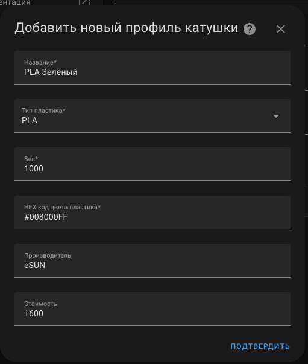
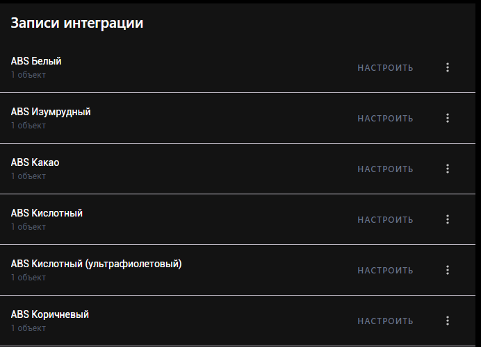
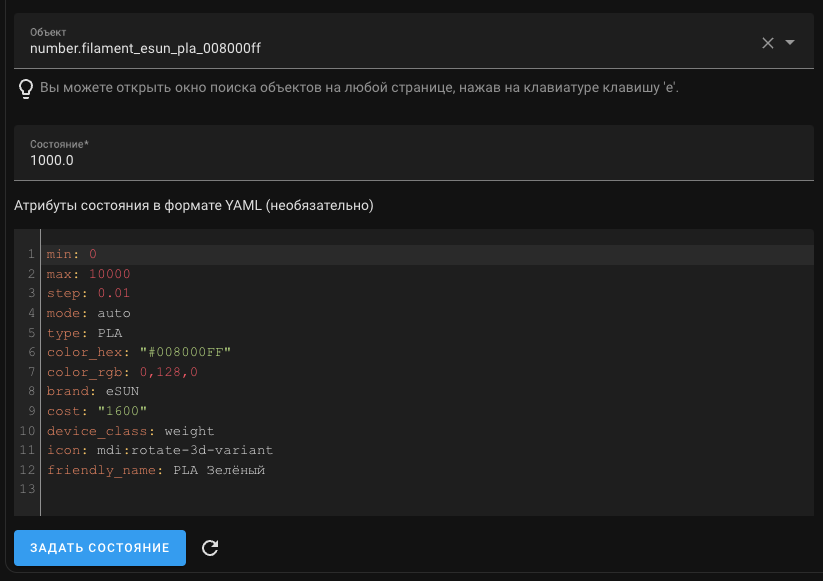
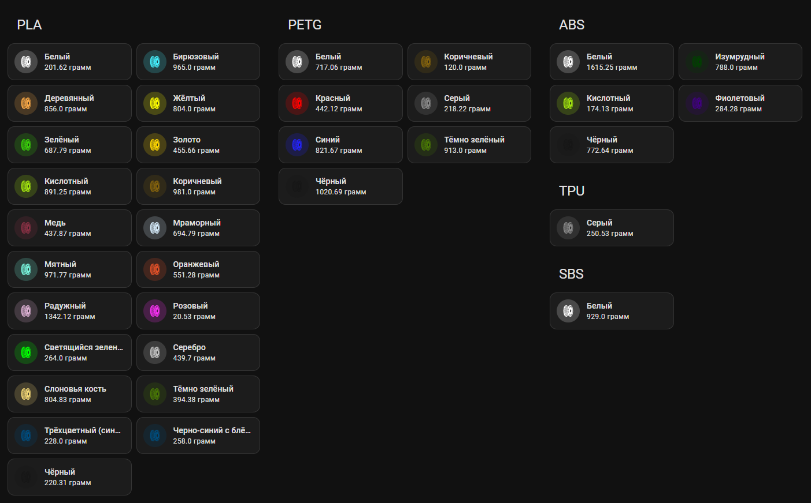
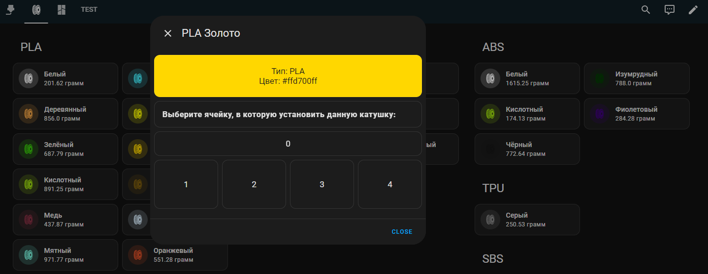
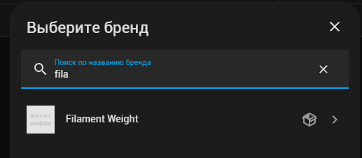

# Filament Weight
[](https://github.com/custom-components/hacs)


[](https://www.tinkoff.ru/rm/dontsov.sergey22/KEZ6r54259)

# Дисклеймер
Проект ещё не окончен. Данную интеграцию делал изначально для себя, доработки и пожелания приветствуются.

## TODO
- [x]  Сделать настройку собственных типов и производителей филамента.
- [ ] Динамически определять количество AMS и подстаривать количество ячеек во всплывающем окне.


# Описание

Хотел как-то отслеживать все свои катушки что есть в наличии. Раньше писал всё в exel файле, что было удобно, для отслеживания типа и цвета в наличии.
Но затем мне захотелось знать примерный остаток веса каждой из катушек.

Эксель файл с весом катушек я вёл неделю, затем либо забывал, либо было лень вычислять всё и записывать - в итоге привратилось всё это в интеграцию для HA.

Данная интеграция позволяет добавлять катушки, вводя их имена для отображения, тип катушки, цвет в HEX формате и изначальный вес.

Создаются объект для каждой катушки в формате:
```
number.filament_%производитель(если заполняли)%_%тип%_%цвет%
```

### Пример:
```
number.filament_esun_pla_008000ff

number.filament_pla_008000ff
```

Состояние - вес катушки

friendly_name - Название которое вписали

И кастомные атрибуты:
```
type: PLA
color_hex: "#008000ff"
color_rgb: 0,128,0
```
И два необязательных
```
brand: eSun
cost: 1600
```



После добавлений N количества будет примерно так:





### Что делать с этими данными?

Да что угодно, лично я после успешной печати автоматически вычисляю какая катушка была установлена в принтере и вычитает из профиля количество потраченного пластика - таким образом я на 90% уверен сколько платсика у меня осталось и хватит ли его на определённую печать.

Так же я сделал "быструю" смену типа и цвета катушки в bambu lab




Как это работает:

### ВНИМАНИЕ
Данная доработка работает только с одной системой AMS.
Возможно будет доработка для 0-4 AMS.

Для данной доработки необходимо установить мой форк интеграции [ha-bambulab](https://github.com/Striker72rus/ha-bambulab) в ней доработана отправка команды на смену катушек.
Установить зависимые кастомные компоненты:
* [lovelace-mushroom](https://github.com/piitaya/lovelace-mushroom)
* [hass-browser_mod](https://github.com/thomasloven/hass-browser_mod)
* [lovelace-auto-entities](https://github.com/thomasloven/lovelace-auto-entities)
* [custom-brand-icons](https://github.com/elax46/custom-brand-icons)
* [button-card](https://github.com/custom-cards/button-card)

Создать скрипт через интерфейс
> Настройки > Автоматизации и сцены > Скрипты > Создать скрипт

```yaml
alias: Multi Tap Action
sequence:
  - repeat:
      for_each: "{{actions}}"
      sequence:
        service: "{{repeat.item.service}}"
        data: "{{repeat.item.data}}"
mode: parallel
description: Используется для смены катушек в Bambu lab принтерах
```

После установки, небходимо добавить интеграцию Browser mod в настройках. Далее добавляете новую кастомную карточку со следующим [содержимым](custom_card.yaml). Надеюсь смогу его оптимизировать в будущем.

Необходимо будет только поправить Title и две переменные:
```

Меняете Тип пластика, который необходим для отображения
```
```


model_serial_change_filament_spool_ams - заменяете на свой сервис, нужного принтера
```
Найти нужное имя сервиса можно тут:
Панель разработчика > Службы > Начните вводить "bambu_lab"

И увидите нужное название сервиса

# Установка

**Способ 1. #Рекомендую#** [HACS](https://hacs.xyz/)

> HACS > Интеграции > 3 точки (правый верхний угол) > Пользовательские репозитории > URL: `Striker72rus/filament_weight`, Категория: Интеграция > Добавить > подождать > Filament weight > Установить

**Способ 2.** Вручную скопируйте папку `filament_weight` из [latest release](https://github.com/Striker72rus/filament_weight/releases/latest) в директорию `/config/custom_components`.

# Настройка

**configuration.yaml**

Чтобы создать свои списки для типа платсика и производителей, необходимо в конфигурацию внести данные как в примере, заменив на свои значения. Значений может быть сколько угодно.

```yaml
filament_weight:
  brands:
    - brand1
    - brand2
    - brand3
  type:
    - PLA
    - ABS
    - PETG
    - TPU
```

**GUI**

> Настройки > Интеграции > Добавить интеграцию > **Filament weight**


